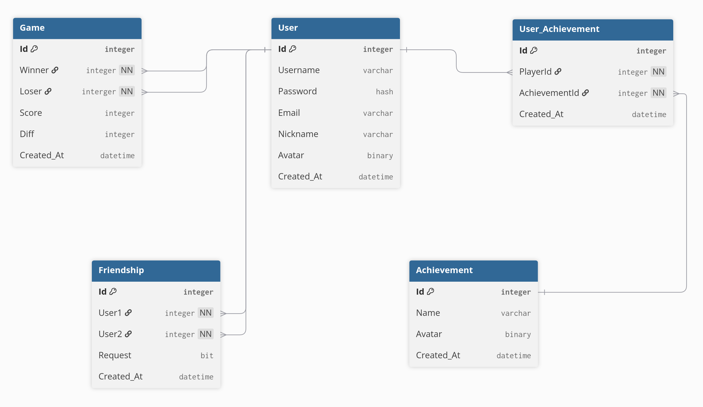
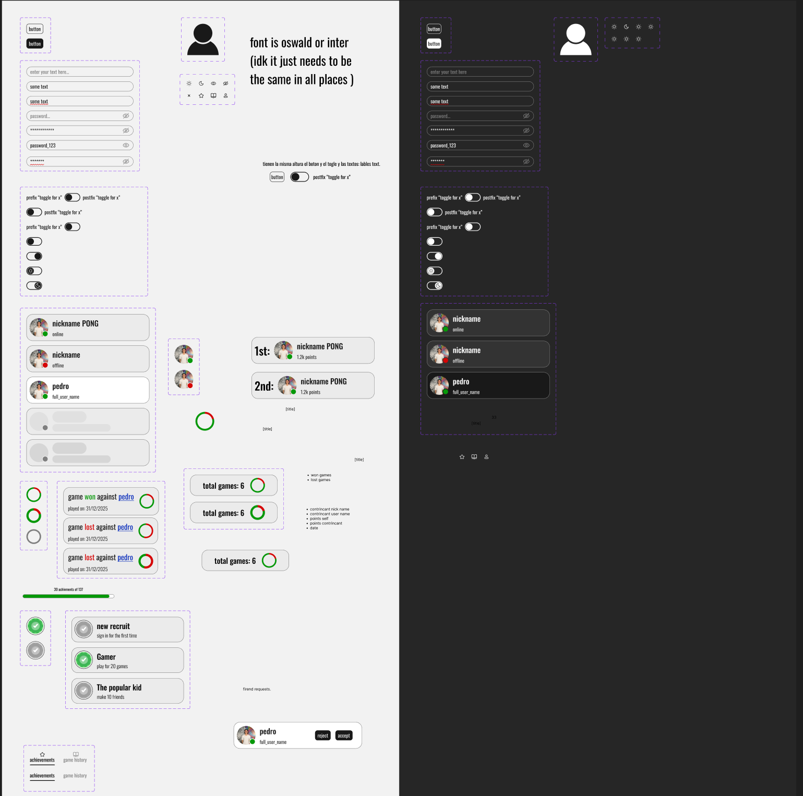

*This project has been created as part
of the 42 curriculum by amagnell, andmart2, josorteg, kkoval and tatahere*

## Description
Our ft_transendence consists of a web application where users can play pong against another user locally, without registering, or also remotely if they're signed in. 

With registration users are able to have a personalized display name and avatar, friend other registered users, and look at their game history and statistics.

## Instructions
Prerequisites:
- Docker installed in your PC
- correct env secrets to paste into .envs for things like OAuth.2.0 to work properly

Clone the project then run `make up` in the root of the repository. This will create the .envs needed which you can modify as needed.
## Team Information
We divided the work in different responsabilities. josorteg and amagnell were in charge of the backend, tathere and andmart2 were in charge of the frontend, and kkoval would own the pong game which was the main feature of our webapp.

## Project management
We organized ourselves through a Whatsapp group chat where we shared our advancements and where we coordinated for meetings and tasks.

At first we had a scheduled video call, specially because all team memebers had other responsabilities outside the project, but once the project was more advanced we slowed the meetings up for more specific coordination.

In the docs folder we have some other documents that were useful in managing the project and keeping team objectives on track.

## Technical Stack
**Frontend:** Vue with Tailwind CSS

**Backend:** Fastify

**Database:** Sqlite
## Database Schema

Our initial design of the database.

As of our latest implementation we lack the achievements table where we fell short on time.
## Features List
Mandatory requirements:
- Frontend                  -   andmart2, kkoval, tatahere
- Backend                   -   amagnell, josorteg, kkoval
- Database                  -   josorteg
- Containerized deployement -   amagnell
- User management system    -   amagnell, josorteg

Modules:
- Websockets                -   kkoval
- API                       -   josorteg
- Design system             -   andmart2, tatahere
- User management and auth  -   amagnell, josorteg
- Game statistics           -   josorteg, tatahere
- Remote authentication     -   amagnell
- Web-based game            -   kkoval
- Remote players            -   kkoval

## Modules

| Module                                                             | Points  |  Members                                        |
| ------------------------------------------------------------------ | ------- | --------                                        |
| Use a framework for both the frontend and backend                  | 2       |  Everyone                                       |
| Implement real-time features using WebSockets or similar technology| 2       |  kkoval                                         |
| A public API to interact with the database with a secured API key  | 2       |  josorteg, amagnell                             |
| Custom-made design system with reusable components                 | 1       |  tatahere, andmart2                             |
| Standard user management and authentication                        | 2       |  josorteg, amagnell                             |
| Game statistics and match history                                  | 1       |  josorteg, tathere                              |
| Implement remote authentication with OAuth 2.0.                    | 1       |  amagnell                                       |
| Implement a web-based game where users can play against each other | 2       |  kkoval                                         |
| Remote players                                                     | 2       |  kkoval                                         |
| **TOTAL**                                                          | **15**  |  ＼(^o^)／＼(^o^)／＼(^o^)／＼(^o^)／＼(^o^)/      |

This project began with the old requirements then we decided to adapt it to the new subject, which we thought would make for a more solid project. 

Because this was a Pong project from the start with some features already decided before the new list of modules was available the biggest change was dropping the tournament system where we foresaw some issues which would be difficult to solve in our limited time frame to finish the project.
### Use frameworks for both the backend and frontend

With the mandatory requirement of having a frontend and a backend it seemed logical to complete these modules by adding a framework to each one.

In the backend we went with Fastify following the previous subject and in the frontend we decided on Vue because our team was unfamiliar with javascript and frontend development and Vue appeared friendlier to newbies.

### Web Game, Websockets, and Remote players

The Pong game implementation was mainly inspired and followed the logic of the original Pong 1971 game. We decided to use Authoritative server architecture. All calculations and general managment of movement of paddles, ball and score of the game resides on the backend container and frontend only renders the image using Canvas Api. This way we protect our game from possible cheating and secure the same rendering image for both players. The comunication happens via web sockets, where front end sends an message every time  player presses the keys to backend and backend does a calculation of movement and collisions and sends an updated game state of ball, paddles and scores to be rendered by frontend.

### Public API

We have prepared the database to allow external access to other applications via an API key.
The idea is to be able to grant permissions to other services so they can consume our data, and to control what they can access and what they cannot.
This will also allow us to access the database directly for maintenance, querying, or testing during development.
Requests must go through the proxy, since the database is not public, but at the same time they must include the API key in order to access the database without going through the backend.

### Custom design system with reusable components

[Project Figma](https://www.figma.com/design/pU9rJmGdOkIRibzAE4bCde/trancendence-project.?node-id=55-24&t=alP5ZIQxnzLlUfGN-1)

### Standard user management

This module was another natural choice as basic user management was already required and adding the features needed simply filled out the feature. 

Users can see their information in their user page and modify their nickname and or avatar in their setting page.

Users can upload avatars which are saved in our server and the route to the image is saved in our database which the frontend uses to render it on the client.

### Game statistics and match history

The pong games played are stored in a database with score, winner, difference in point. This data is used to show a user's game history on their profile and also keep a leaderboard of the players with the most ranking points, something calculated by their number of wins and multiplier factor.

### Remote authentication with OAuth 2.0

Github OAuth 2.0 has been implemented, there's an option to instead of registering via email and password to sign up with Github. After you've signed up with it you can sign with it in the sign in page. It was implemented with @fastify/oauth2 plugin plus the @fastify/cookie plugin. To implement it, the users entity in the database had to be slightly modified, the password and email were made nullable and a githubid field was added. The logic of login and registration of github users and normal users is separated.

## Individual Contributions

### amagnell
I handled the initial network setup, user session logic in the backend implemented with JWT, the implementation of oauth2.0., and kept track of project goals. There were definitely growing pains from this being my, and other teammates', first web project.

The biggest technical challenge for me was JWT implementation, mostly because I did not realize it's whole scope at first and I felt the pressure of user sessions being stable so everyone else could work and test smoothly. I'm glad to say if I had to do it again I would have a much clearer idea of what needs to get done first and kept things closer to production settings faster. 

### andmart2 

Development of reusable components using Vue.js.
Implementation of Sign-Up and Edit Profile forms.
Design and implementation of UX/UI layouts in collaboration with tathere and amagnell.
Avatar upload and profile picture management.
Coordination with the backend team to define and integrate data exchange requirements.

### josorteg

Database design and creation.
Full development of an independent database secured via API key access.
Backend structure and configuration, including Swagger implementation for development and testing.
Development of endpoints and business logic (in collaboration with Amagnell).
Creation of services to support front-end integration.

### kkoval
I had to revisit my geometry classes to calculate the angles for ball collisions (shoutout to Borja :D). While I was initially intimidated by WebSockets and transitioning from a local-only game to a remote multiplayer experience, the process turned out to be very logical and smooth. The biggest challenge was envisioning how my piece of work would fit into the team's workflow while balancing so many new frameworks and tools simultaneously.

### tatahere

Responsible for the web page design, balancing a mobile-first accessible interface with an appealing design. Giving it the identity and ensuring consistency across the web app. And implemented many of the pages and integrated with the backend infrastructure.

## Resources

### General concepts
[HTTP response status codes](https://developer.mozilla.org/en-US/docs/Web/HTTP/Reference/Status) - A constant reference in a web project. HTTP responses in particular but loads of good articles in developer.mozilla.org

[What is the difference between JSON and schema](https://www.designgurus.io/answers/detail/what-is-the-difference-between-json-and-schema)

[Should Logging Out Be a GET or POST?](https://www.baeldung.com/logout-get-vs-post)

### Implementation references
Most package documentation found at [npmjs.com](https://www.npmjs.com/). And if not their github repo or in this case in [particular](https://npm.io/package/@fastify/oauth2) npm.io.

#### Tutorials and examples

[Adding JWTs to a fastify server](https://kevincunningham.co.uk/posts/adding-jwts-to-a-fastify-server/)

[How to integrate github sign in a four step guide](https://dev.to/lovestaco/how-to-integrate-github-sign-in-a-four-step-guide-1doj) - Clear steps to take to implement oauth2 even if we have different tech stacks.

[References for uploading](https://betterstack.com/community/guides/scaling-nodejs/fastify-file-uploads/) [avatars to server](https://www.xjavascript.com/blog/fastify-multipart-typescript/)

#### AI usage

AI was an excellent resource for generating examples for specific edge cases. It’s particularly effective for learning new concepts because it uses a more accessible vocabulary for beginners and can adapt its explanations based on your current knowledge level. Beyond the logic, it was also a massive time-saver for handling tedious tasks like formatting syntax and managing curly brackets. And emotional support for some.
